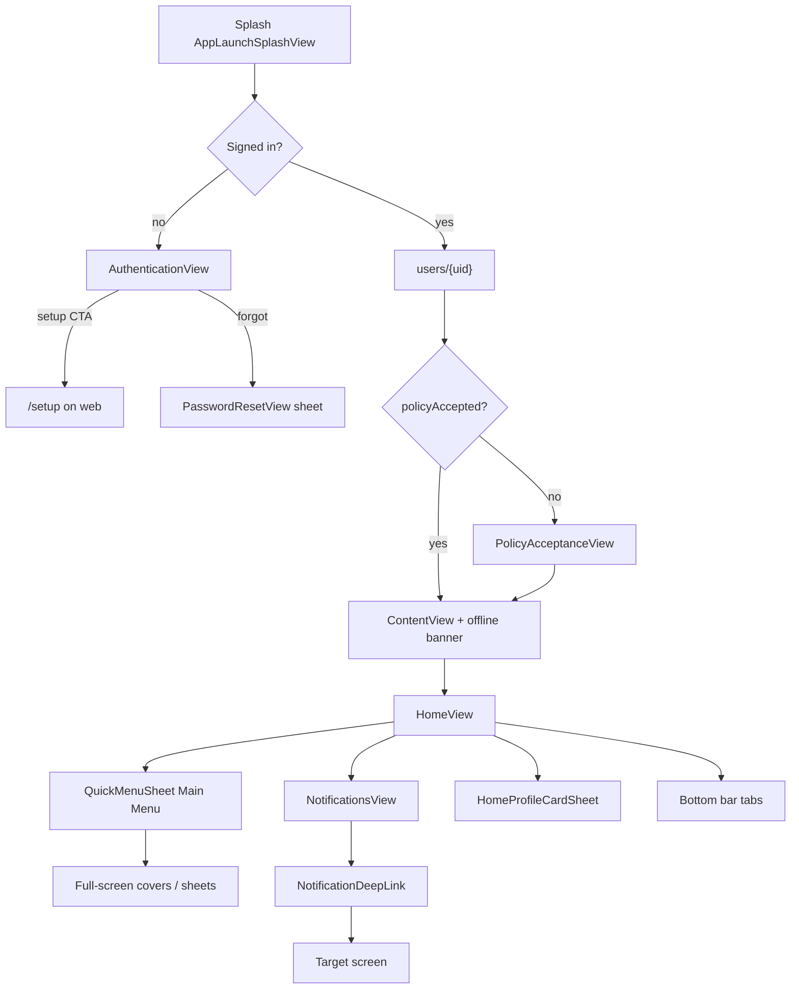

# 02 — Navigation map

> Spec: rebuild Phase 1 `02-navigation-map.md` · Blueprint starting point: §2 and §9 screen index.
>
> Swift not on disk. Tab order, labels, icons and permission gates are from Blueprint §2. Web column is the **existing** App Router. Proposed Phase 2 map **keeps the `/dashboard` prefix** so current bookmarks keep working, unless Farnie prefers the flatter Blueprint §2.3 paths.

## 1. iOS top-level navigation

iOS has **no system `TabView`**. `ContentView.swift` draws a custom bottom bar: rounded (radius 18) translucent rows, soft upward shadow.

### Primary row

| Position | Tab | Screen | Visible when | SF Symbol |
|---|---|---|---|---|
| Fixed left | Home | `HomeView` | Always | `house.fill` |
| Movable (default 1) | Projects | `ProjectsView` | Always (list filtered by `visibleWorks`) | `folder.fill` |
| Movable (default 2) | Small Works | `SmallWorksView` | Always | `hammer.fill` |
| Movable (default 3) | Manage Operatives | `OperativesView` | `canViewOperatives` | `person.3.fill` |
| Fixed right | More | `MainMenuMoreSheet` | Always | (more) |

Tab tags (`ContentView.swift`): 0 Home, 1 Projects, 2 Small Works, 3 Manage Operatives, 4 Managers, 5 Settings, 6 Help, 7 Wholesalers, 8 Annual Leave, 9 Sub Contractors.

### Movable secondary tabs (default order)

Annual Leave, Managers, Wholesalers, Sub Contractors, Settings, Help. **Operatives only get Annual Leave and Settings.**

Order persisted **per user, on device**: `bottomBarMovableTabOrder.{uid}`. “Edit main menu bar” jiggle-drag. Detail screens hide the bottom bar. Booking toast: green, 3s, `calendar.badge.plus`.

### Labels

`navigationLabel(key, fallback)` reads `organizations/{orgId}.settings.uiLabels.navigationLabels`. Keys: `dashboard_home`, `dashboard_projects`, `dashboard_small_works`, `dashboard_operatives`, `dashboard_managers`, `dashboard_schedule`, `dashboard_settings`, `site_audit`. Legacy “Schedule” / “my schedule” display as **My Schedule**.

Role preview (admins): orange banner “Role preview: {role}”, text about Firebase still using the real account, **Reset**. Nav only.

## 2. Main Menu catalogue

One catalogue (`Navigation/MainMenuCatalog.swift`) drives Home → Main Menu and More. Header “Main Menu” 22pt + blue Done capsule. Quick create card (blue gradient): Project / Small work / User / Task (permissioned; Task always). Then grouped white cards:

| Section | id | Title (subtitle/badge) | Shown when | Action |
|---|---|---|---|---|
| top | `edit_tab_bar` | Edit main menu bar | Not operative | Reorder bar |
| Navigate | `clients` | Clients (`{n} on file`) | Not operative | Clients |
| Navigate | `projects` | Projects (`{n} in progress`) | Always | Tab 1 |
| Navigate | `small_works` | Small works (`{n} open`) | Always | Tab 2 |
| Navigate | `operatives` | Operatives (`{n} team members`) | `canViewOperatives` | Tab 3 |
| Navigate | `managers` | Managers (`{n} active`) | `canViewManagers` | Tab 4 |
| Navigate | `holiday` | Annual Leave | leave enabled | Tab 8 |
| Navigate | `site_map` | Site map | Admin | Site map |
| Navigate | `site_audit` | Site audit | `canViewSiteAudit` | Site audit |
| Navigate | `invoicing` | Timesheets (“My timesheets and operative sign-off”) | `canAccessTimesheetsSurface` | Timesheets |
| Tools | `qualifications` | Qualifications (badge `{n} expiring` within 30 days) | `canAccessQualificationsHub` | Qualifications |
| Tools | `my_qualifications` | My qualifications | Operative | My qualifications |
| Tools | `job_types` | Job types | Admin | Job types |
| Tools | `wholesalers` | Wholesalers | `canAccessWholesalers` | Wholesalers |
| Tools | `material_catalogue` | Material catalogue (“Organisation materials library”) | `canManageMaterialCatalogue` | Catalogue |
| Tools | `subcontractors` | Sub contractors | `canManageSubcontractors` | Tab 9 |
| Team | `add_user` | Add user | `canManageUsers` | Add user |
| Team | `manage_users` | Manage users (managers with operatives: “Manage operatives”) | `canManageUsers` OR manager+operatives | Manage users |
| App & account | `settings` | Settings | Always | Tab 5 |
| App & account | `help` | Help & support | Not operative | Tab 6 |
| App & account | `reset_password` | Reset password | Always | send reset to own email |
| App & account | `sign_out` | Sign out (red) | Always | Sign out |

Footer: app version. **Skills is not in this catalogue** (deprecated). `staff-skills` is barred from Home quick actions.

## 3. Flow (iOS)

Boot order after shell (Blueprint §1.2): projects+small works + operatives/managers/quals + **live bookings** → live manager site bookings → tasks → deferred holidays then subcontractors. Notifications load when inbox opens; unread badge warmed later. Foreground: throttled `lastSeenAt`, reload profile, refresh bookings + manager schedule.

## 4. Notification deep links

| `type` | Opens |
|---|---|
| `booking_created` | Operatives: My Schedule. Else: Daily overview |
| `operative_created`, `manager_created`, `line_manager_peer_update` | Manage users |
| `client_created` | Clients |
| `project_created` | Project detail (`relatedId`) or Projects list |
| `small_works_created` | Small works detail, or New small works if no id |
| `booking_clash`, `warning_removed`, `qualification_expiry`, `material_order_cut_off` | Warnings |
| `task_completed`, `task_created`, `deadline_assigned`, `deadline_reminder`, `deadline_due` | Tasks |
| `holiday_request_submitted` | Annual leave, Pending tab |
| `holiday_request_approved`, `holiday_request_declined` | Annual leave |
| `timesheet_pending_manager_signoff`, `timesheet_signed_by_manager` | Timesheet review `?user=&weekStart=` |

## 5. Proposed web route map

**Keep `/dashboard` as the authenticated prefix** (already shipped). Map Blueprint §2.3 ids onto these. Public routes stay as they are.

| iOS route id / screen | Proposed web route | Existing web? | Notes |
|---|---|---|---|
| Login | `/login` | yes | Restyle to iOS dark login in Phase 2 |
| Setup org | `/setup` | yes | **Keep** (iOS CTA) |
| Invite accept | `/setup-password?token=` **and** `/setup-password.html?token=` | `/setup-password` only | Add rewrite/html so iOS emails keep working |
| Password reset (signed out) | `/reset-password` | yes | |
| Home | `/dashboard` | yes | Replace customisable 22-tile home unless Farnie keeps it |
| Projects | `/dashboard/projects` | yes | |
| New project | modal on list **or** `/dashboard/projects/new` | `/new` page | Blueprint: 800px modal on desktop |
| Project hub | `/dashboard/projects/[id]` | yes | |
| scheduling | `…/[id]/schedule` | yes | |
| visibility (View) | `…/[id]/view` | yes | |
| tasks | `…/[id]/tasks` | yes | |
| materials | `…/[id]/materials` | yes | |
| H&S | `…/[id]/health-safety` | yes | |
| deadlines | `…/[id]/deadlines` | **missing** | add |
| site audit | `…/[id]/site-audit` | yes | |
| location | `…/[id]/location` | yes | |
| active users | `…/[id]/active-users` | **missing** | add |
| Small works | `/dashboard/small-works` + same children | yes except deadlines/active-users | |
| Clients | `/dashboard/clients` | yes | master–detail desktop |
| Operatives | `/dashboard/operatives` | yes | |
| Managers | `/dashboard/managers` | yes | |
| Annual leave | `/dashboard/annual-leave` | yes | |
| Team leave | `/dashboard/annual-leave/operatives` | yes | |
| Site map | `/dashboard/site-map` | yes | |
| Site audit hub | `/dashboard/site-audit` | yes | |
| Timesheets | `/dashboard/timesheets` | yes | deep link `?user=&weekStart=` |
| Qualifications | `/dashboard/qualifications` | yes | |
| My qualifications | `/dashboard/qualifications/mine` or keep `/dashboard/my-qualifications` | latter exists | |
| Job types | `/dashboard/job-types` | yes | |
| Wholesalers | `/dashboard/wholesalers` | yes | |
| Material catalogue | `/dashboard/material-catalogue` or keep `/dashboard/materials` | `/materials` exists | |
| Sub contractors | `/dashboard/sub-contractors` | yes | |
| Add user | `/dashboard/users/new` (wizard modal) | `/dashboard/settings/users/new` | keep existing unless flattening |
| Manage users | `/dashboard/users` | `/dashboard/settings/users` | |
| User profile | `/dashboard/users/[userId]` | yes | |
| Tasks (global) | `/dashboard/tasks` | yes | |
| My Schedule | `/dashboard/schedule` or keep `/dashboard/my-schedule` | `/my-schedule`; `/dashboard/schedule` **redirects to daily-overview** | **fix redirect** |
| Daily overview | `/dashboard/daily-overview` | yes | |
| Weekly report | `/dashboard/weekly-report` | yes | |
| Warnings | `/dashboard/warnings` | yes | |
| Notifications | `/dashboard/notifications` + desktop slide-over | **missing** | |
| Settings hub | `/dashboard/settings` | yes | nested org routes in §6.17 |
| Switch org | `/dashboard/settings/switch-organisation` | `/dashboard/change-organisation` | keep either |
| Help | `/dashboard/help` | yes | |
| Privacy | `/dashboard/privacy` | **missing** (dead settings row) | |
| Skills | `/dashboard/skills` | removed | **Gate 1 Q5:** dropped from web (redirects to `/dashboard`); iOS already deprecated |

**Do not drop:** `/setup/*`, Stripe success/cancel, `/api/*`.

**Desktop shell (Blueprint §3.1):** ≥1280px left sidebar = Main Menu catalogue (not the current long Navigate dump). &lt;768px = iOS bottom bar. Top bar: title, + New, refresh, bell, avatar.

## 6. Screen index → web

Presentation: P = push/page, S = sheet/modal, F = fullScreenCover, A = alert, M = menu.

| # | Section | Swift view (file) | Reached from | Presentation | Roles | Web route or component |
|---|---|---|---|---|---|---|
| 0 | Boot | `AppLaunchSplashView` (`AppBranding.swift` L20) | launch | P | all | none — add splash |
| 1 | Auth | `AuthenticationView` L28 | signed out | P | signed out | `/login` ⚠️ layout differs |
| 2 | Auth | `PasswordResetView` L4 | login | S | signed out | `/reset-password` |
| 3 | Auth | `PolicyAcceptanceView` L11 | first sign-in | P | signed in, policy false | **missing** |
| 4 | Auth | `PrivacyPolicyView` L10 | gate + Settings | P/S | all | **missing** |
| 5 | Shell | `ContentView` L32 | after policy | P | all | `app/dashboard/layout.tsx` |
| 6 | Shell | `MainMenuMoreSheet` L10 | More tab | S | all | sidebar / More |
| 7 | Shell | `QuickMenuSheet` L10 | Home Main Menu | S | all | sidebar |
| 8 | Home | `HomeView` L11 | tab 0 | P | all | `/dashboard` ⚠️ different home |
| 9 | Home | `AdminHomeOverviewCustomizeSheet` L52 | Home gear | S | admin | localStorage `homeOverviewMetrics.v1.{uid}` — web has `/dashboard/edit` instead |
| 10 | Home | `HomeQuickActionAddSheet` L2034 | Customise | S | all | missing iOS tile set |
| 11 | Home | `HomeProfileCardSheet` L1898 | avatar | S | all | avatar menu TBD |
| 12 | Home | `OperativeQualificationsReadOnlyView` L1773 | menu / quick action | S | operative | `/dashboard/my-qualifications` |
| 13 | Clients | `ClientsView` L10 | menu | F | not operative | `/dashboard/clients` |
| 14 | Clients | `ClientDetailsView` L163 | list | P | not operative | same page / detail |
| 15 | Clients | `CreateClientView` L10 | list | S | not operative | inline / modal |
| 16 | Clients | `EditClientView` L10 | detail | S | not operative; delete admin | |
| 17 | Projects | `ProjectsView` L10 | tab 1 | P | all (filtered) | `/dashboard/projects` ⚠️ operatives hidden in web nav |
| 18 | Projects | `CreateProjectView` L12 | + | S | `canManageWorkCatalogue(.projects)` | `/dashboard/projects/new` |
| 19 | Projects | `EditProjectView` L17 | ⋯ | S | can edit | `…/[id]/edit` |
| 20 | Projects | `MapPinPickerView` L13 | create/edit | S | | `SitePinPickerSheet` |
| 21 | Projects | `ProjectDetailView` L47 | card | P | visible jobs | `/dashboard/projects/[id]` |
| 22 | Projects | `ProjectVisibilitySettingsView` L2517 | View tile | P | can configure | `…/view` |
| 23 | Projects | task sheets in `ProjectDetailView` (Add/Edit/Complete/Filters/People) | My Tasks | S | | `…/tasks` + `/dashboard/tasks` |
| 24 | Small works | `SmallWorksView` L11 | tab 2 | P | all | `/dashboard/small-works` |
| 25 | Small works | `CreateSmallWorksView` L12 | + | S | smallWorks catalogue | `…/new` |
| 26 | Operatives | `OperativesView` L15 | tab 3 | P | `canViewOperatives` | `/dashboard/operatives` |
| 27 | Operatives | filters / Add / Edit / Finish setup | list | S | | `/new`, `/[id]/edit` |
| 28 | Operatives | `OperativeProfileView` L12 | row | S | | `/dashboard/operatives/[id]` |
| 29 | Managers | `ManagersView` L11 | tab 4 | P | admin | `/dashboard/managers` |
| 30 | Managers | `CreateManagerView` L10 | + | S | admin | `/new` (roster, not account) |
| 31 | Leave | `HolidayView` L11 | tab 8 | P | leave enabled | `/dashboard/annual-leave` |
| 32 | Leave | `HalfDayHolidayBookingEditorSheet` L1354 | calendar | S | | |
| 33 | Leave | `OperativeAnnualLeave*` views | team card | P | admin or manager+operatives | `/dashboard/annual-leave/operatives` |
| 34 | Leave | `HolidayReportView` L3 | Manage Users | S | | missing? |
| 35 | Map | `OrgSitesMapView` L4 | menu | S | admin | `/dashboard/site-map` |
| 36 | Audit | `SiteAuditHubView` L199 | menu / tile | S | `canViewSiteAudit` | `/dashboard/site-audit` |
| 37 | Audit | create flow / item / detail / success | hub | P/S | | `/site-audit/new` + project child |
| 38 | Timesheets | `InvoicingView` L12 | menu | S | `canAccessTimesheetsSurface` | `/dashboard/timesheets` |
| 39 | Timesheets | My / Previous / Review / Sign / Invoice sheets | hub | S | self-employed / managers | same page (partial) |
| 40 | Quals | `QualificationsManagementView` L24 | menu | S | hub policy | `/dashboard/qualifications` |
| 41 | Quals | Add/Edit organisation qualification | hub | S | can manage org quals | |
| 42 | Quals | `AssignQualificationsPickerView` L5 | My Quals | S | | |
| 43 | Job types | `JobTypesManagementView` L3 | menu | S | admin | `/dashboard/job-types` |
| 44 | Job types | `AddJobTypeView` L91 | list | S | admin | |
| 45 | Wholesalers | `WholesalersListContent` L28 | tab 7 / menu | S | `canAccessWholesalers` | `/dashboard/wholesalers` |
| 46 | Wholesalers | detail / history / editor / contacts | list | P/S | history also `canViewWholesalerOrderHistory` | |
| 47 | Catalogue | `MaterialCatalogueRootView` L11 | menu | S | admin or manager | `/dashboard/materials` |
| 48 | Catalogue | editor / detail / CSV import | root | S | | |
| 49 | Materials | `MaterialsView` / `OperativeMaterialsView` | job tile | P | materials flag for operatives | `…/materials` |
| 50 | Materials | send list / review / send to wholesaler | materials | S | cannot send if operative | |
| 51 | Subs | `SubcontractorsView` L3 | tab 9 | P | `canManageSubcontractors` | `/dashboard/sub-contractors` |
| 52 | Subs | firm details / editor / operative editor | list | P/S | | |
| 53 | Subs | `ScheduleSubcontractorView` L3 | job scheduling | S | managers | `…/schedule/subcontractors` |
| 54 | Users | `AddUserView` L10 | menu | S | `canManageUsers` (manager variant) | `/dashboard/settings/users/new` |
| 55 | Users | `ManageUsersView` L13 | menu | S | admin, or manager+operatives (title changes) | `/dashboard/settings/users` ⚠️ managers-with-operatives not in web nav |
| 56 | Users | `EditUserView` L1267 | row | S | | `/dashboard/users/[userId]` |
| 57 | Users | `LineManagersMultiSelectSheet` L3 | add/edit user | S | | `LineManagerMultiSelect` |
| 58 | Settings | `SettingsView` L13 | tab 5 | P | all | `/dashboard/settings` |
| 59 | Settings | `SettingsProfileDetailView` L98 | Personal | P | all | panel |
| 60 | Settings | `AppearanceSettingsView` L10 | Personal | P | all | panel / missing dedicated route |
| 61 | Settings | `ChangePasswordView` L10 | Sign-in & password | P | all | `/dashboard/settings/password` |
| 62 | Settings | `SettingsNotificationsHubView` L365 | Personal | P | not operative | panel |
| 63 | Settings | `SwitchOrganisationView` L10 | Personal | P | all | `/dashboard/change-organisation` |
| 64 | Settings | `OrganisationSettingsHubView` L10 | Company-wide | P | admin | `OrganisationHubPanel` |
| 65 | Settings | Company / Currency / Working hours / AL defaults / Schedule options / Warnings / Cut-off / Payment runs | org hub rows | P | admin | settings panels (no nested URLs yet) |
| 66 | Settings | `WarningExcludedUsersPickerView` L630 | Warnings settings | S | admin | |
| 67 | Help | `HelpView` L11 + category/step | tab 6 / menu | P | not operative | `/dashboard/help` |
| 68 | Tasks | `TasksDetailView` L24 | Home / menu | S | all | `/dashboard/tasks` |
| 69 | Warnings | `WarningsDetailView` L46 | Home / menu | S | **admins** (iOS) | `/dashboard/warnings` ⚠️ web gated like daily overview |
| 70 | Warnings | `WarningDismissConfirmationSheet` L712 | card | S | admin | |
| 71 | Schedule | `MyScheduleView` L468 | quick action | S | all (operatives read-only) | `/dashboard/my-schedule` |
| 72 | Schedule | self-booking sheets | My Schedule | S | manager/admin | |
| 73 | Schedule | `ScheduleOperativeView` L12 | job Scheduling | S | | `…/schedule/operatives` |
| 74 | Schedule | `BookLabourFlowView` L49 | Daily overview / Warnings | S | | |
| 75 | Schedule | `SelectOperativesView` L8 | book labour | S | | |
| 76 | Schedule | clash / hours / confirmation views | booking flows | S | | partial (`OperativeClashReviewPanel`) |
| 77 | Daily | `DailyOverviewView` L26 | quick action | S | `canViewDailyOverview` | `/dashboard/daily-overview` |
| 78 | Daily | `HistoricDailyOverviewView` L1459 | past dates | S | same | |
| 79 | Weekly | `WeeklyReportView` L19 | quick action | S | `canViewWeeklyReports` | `/dashboard/weekly-report` |
| 80 | H&S | `ProjectHealthSafetyView` L624 + issue/sign/upload sheets | job tile | P | | `…/health-safety` |
| 81 | Deadlines | `DLDeadlinesScreen` L25 + detail/reschedule/edit/attach | job tile | P | | **no web route** |
| 82 | Active users | `ProjectActiveOperativesView` L31 | job tile | P | can see active operatives | **no web route** |
| 83 | Location | Site Location in `ProjectDetailView` ~L1774 | job tile | P | | `…/location` |
| 84 | Notifications | `NotificationsView` L10 | bell | S | all (filtered) | **no inbox route** |
| 85 | Offline | `OfflineSyncQueueSheet` L117 | banner | S | all | ask before porting |
| 86 | Dev tools | Manual Link / Test Email in `SettingsView` | Settings | P | | **do not port** |

§9 lists additional nested sheets (signature pads, money entry, site-audit steps, toolbox talks, etc.). Those belong in the section 3A specs, not as top-level routes.

## Web nav that is **not** in the iOS catalogue

| Web item | File | Decision |
|---|---|---|
| Skills | was `dashboard_skills` | **Removed** (Gate 1 Q5). Route redirects to `/dashboard`. Permission flag still written `false`. |
| Daily overview / Weekly report / Warnings / Tasks / My Schedule as **sidebar rows** | same | On iOS these are Main Menu / quick actions, not primary tabs. Desktop sidebar **should** include them (sidebar = Main Menu). OK if permissioned like the catalogue. |
| Change organisation as always-on account row | web | iOS puts it under Settings → Personal. Either is fine; prefer iOS Settings row + keep a settings child route |
| `/dashboard/edit` | dashboard layouts | web-only (Gate 1 Q) |
| `/dashboard/schedule` → daily overview redirect | `app/dashboard/schedule/page.tsx` | **Wrong** vs iOS My Schedule |

## Blueprint corrections

1. Blueprint §2.3 proposed `/schedule` for My Schedule; this web app already used `/dashboard/schedule` for the org calendar and now redirects it to daily overview. Keep `/dashboard/my-schedule`.
2. Blueprint §2.3 `/material-catalogue` vs existing `/dashboard/materials`.
3. iOS Warnings access is **admins**; web uses `canViewDailyOverview`. Confirm in `WarningsDetailView.swift` when IOS_ROOT is available.
4. iOS `canViewProjects` is always true (operatives still have a Projects tab). Web hides those nav items in operative mode.
